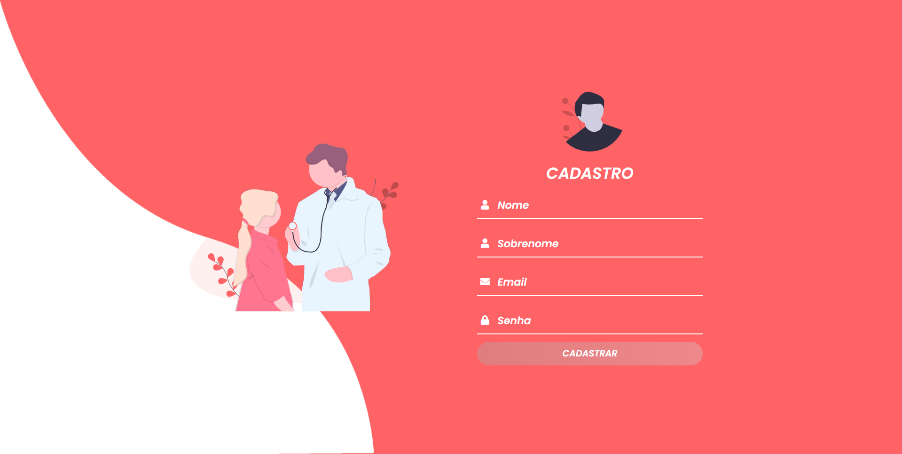

## Clínica Andreatta

## 💡 Sobre

Aplicação feita para gerenciamento de uma clínica médica! ❤️

Este projeto foi construído durante o terceiro período do curso de Engenharia de Software!

A aplicação contém um gerenciamento completo de uma clínica, com controle de estoque, de gastos, de consultas e ainda uma página com dashboard para os admins!

## 🎨 Layout Web 💻

  

  
  
  

Feito com 💞 por Karlos Silva 🚀
